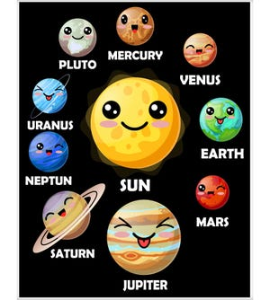

# Planet Greetings 
> The purpose of this project is to simulate what's you will be greeted with if you land on other planet of the solar system.


## Table of Contents
* [General Info](#general-information)
* [Technologies Used](#technologies-used)
* [Features](#features)
* [Screenshots](#screenshots)
* [Setup](#setup)
* [Usage](#usage)
* [Project Status](#project-status)
* [Room for Improvement](#room-for-improvement)
* [Acknowledgements](#acknowledgements)
* [Contact](#contact)
<!-- * [License](#license) -->


## General Information
- This project is written in javascript to showcase codecademy mixed messgae project
- It is for greeting people from different planets
- I took this project to showcase my understanding of coding and problem solving.

<!-- You don't have to answer all the questions - just the ones relevant to your project. -->


## Technologies Used 
- Node - version 12.21.0
- Git  - version 2.30.2


## Features
- It for greeting people on different planet of the solar system.


## Setup
Node.js
git
Text editor of your choice

to run type the command in the terminal
```bash
node main.js

```


## Project Status
Project is: _in progress_

## Room for Improvement
Include areas you believe need improvement / could be improved. Also add TODOs for future development.


To do:
- Add climate type of the planet
- Add currency use on the planet


## Acknowledgements
Give credit here.
- This project was inspired by codecademy mixed-messages project.
- This project was based on [this tutorial](https://www.codecademy.com/paths/full-stack-engineer-career-path/tracks/fscp-javascript-syntax-portfolio-project/modules/fscp-mixed-messages/kanban_projects/mixed-messages).
- Many thanks to the platform for step by step guidance


## Contact
Created by me - feel free to contact me!


<!-- Optional -->
<!-- ## License -->
<!-- This project is open source and available under the [... License](). -->

<!-- You don't have to include all sections - just the one's relevant to your project -->
